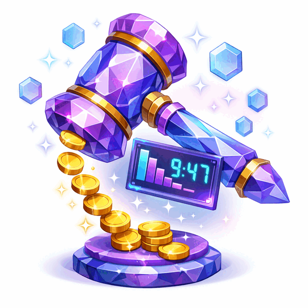

# Dutch Auction - Solana Anchor Program

<p align="center">
  
</p>

A Dutch auction program built with Anchor framework for Solana. In a Dutch auction, the seller sets a starting price that decreases linearly over time until a buyer purchases at the current price.

## Overview

The Dutch Auction program implements an SPL token auction mechanism:

1. **Init**: Seller creates an auction, depositing sell tokens into escrow
2. **Buy**: Buyer purchases at the current (decreasing) price, exchanging buy tokens for sell tokens
3. **Cancel**: Seller cancels the auction before it starts and reclaims sell tokens

This is part of the [Cyfrin Solana Course](https://updraft.cyfrin.io/) - Section 6.

## Project Structure

```
dutch_auction/
├── programs/dutch_auction/src/
│   ├── lib.rs                 # Program entry point + transfer helpers
│   ├── error.rs               # Custom error codes
│   ├── state.rs               # Auction account structure
│   └── instructions/
│       ├── mod.rs             # Module exports
│       ├── init.rs            # Init instruction
│       ├── buy.rs             # Buy instruction
│       └── cancel.rs          # Cancel instruction
├── app/                       # Next.js frontend (see app/README.md)
│   ├── app/                   # Pages and layouts
│   ├── components/            # React components
│   ├── hooks/                 # Program interaction hooks
│   └── generated/             # Codama-generated Kit-native client
├── codama.mjs                 # Client generation script
├── tests/
│   └── dutch_auction.ts       # TypeScript tests
└── README.md
```

## Prerequisites

- [Rust](https://rustup.rs/)
- [Solana CLI](https://docs.solana.com/cli/install-solana-cli-tools)
- [Anchor](https://www.anchor-lang.com/docs/installation)
- [Node.js](https://nodejs.org/) and Yarn

## Setup

```bash
# Sync program keys
anchor keys sync

# Build the program
anchor build

# Run tests
anchor test
```

## Program Instructions

### 1. Init

Creates a new auction and transfers sell tokens into escrow.

**Parameters:**
- `sell_amount: u64` - Amount of sell tokens to auction (must be > 0)
- `start_price: u64` - Starting price (must be >= end_price)
- `end_price: u64` - Minimum price at auction end
- `start_time: u64` - Unix timestamp when auction starts (must be >= current time)
- `end_time: u64` - Unix timestamp when auction ends (must be > start_time)

**Accounts:**
- `seller` (signer, mutable) - The account creating the auction
- `sell_mint` - Mint of the token being sold (InterfaceAccount — supports Token-2022)
- `buy_mint` - Mint of the token accepted as payment (InterfaceAccount)
- `auction` (PDA, mutable) - The auction state account
- `auction_sell_ata` (PDA, mutable) - Escrow token account for sell tokens (InterfaceAccount)
- `seller_sell_ata` (mutable) - Seller's sell token account (InterfaceAccount)
- `token_program` - SPL Token or Token-2022 program (Interface)
- `system_program` - System program

**Validations:**
- Sell token and buy token must be different (`SameToken`)
- Start price must be >= end price (`InvalidPrice`)
- Current time <= start time < end time (`InvalidTime`)
- Sell amount must be > 0 (`InvalidAmount`)

### 2. Buy

Purchases the auctioned tokens at the current price.

**Parameters:**
- `max_price: u64` - Maximum price the buyer is willing to pay (slippage protection)

**Accounts:**
- `buyer` (signer, mutable) - The buyer
- `seller` (mutable) - The auction creator (validated via `has_one`)
- `sell_mint` - Mint of the token being sold (InterfaceAccount)
- `buy_mint` - Mint of the payment token (InterfaceAccount)
- `auction` (PDA, mutable) - The auction state account
- `auction_sell_ata` (PDA, mutable) - Escrow token account (InterfaceAccount)
- `buyer_buy_ata` (mutable) - Buyer's payment token account (InterfaceAccount)
- `buyer_sell_ata` (mutable) - Buyer's account for received tokens (InterfaceAccount)
- `seller_buy_ata` (mutable) - Seller's account for received payment (InterfaceAccount)
- `token_program` - SPL Token or Token-2022 program (Interface)

**Validations:**
- Auction must have started (`AuctionNotStarted`)
- Auction must not have ended (`AuctionEnded`)
- Current price must be <= max_price (`PriceExceedsMax`)
- Buy amount must be > 0 after calculation (`InvalidAmount`)

**Price Calculation:**
```
elapsed = current_time - start_time
duration = end_time - start_time
price_decrease = (start_price - end_price) * elapsed / duration
current_price = start_price - price_decrease
buy_amount = sell_amount * current_price / 10^sell_decimals
```

The price unit is **buy-token smallest units per one whole sell token**. For example, with a 9-decimal sell token and a 6-decimal buy token, setting `start_price = 2_000_000` means 2 buy tokens per sell token.

### 3. Cancel

Cancels the auction and returns sell tokens to the seller. Only allowed **before the auction starts** to prevent front-running buyers.

**Accounts:**
- `seller` (signer, mutable) - Must be the auction creator
- `sell_mint` - Mint of the sell token (InterfaceAccount)
- `auction` (PDA, mutable) - The auction state account
- `auction_sell_ata` (PDA, mutable) - Escrow token account (InterfaceAccount)
- `seller_sell_ata` (mutable) - Seller's token account to receive tokens back (InterfaceAccount)
- `token_program` - SPL Token or Token-2022 program (Interface)

**Validations:**
- Current time must be before `start_time` (`AuctionAlreadyStarted`)
- Seller must match auction creator (`has_one = seller`)

## PDAs

| Account | Seeds | Purpose |
|---------|-------|---------|
| Auction | `["auction", seller, sell_mint]` | Stores auction config |
| Escrow | `["auction_sell_ata", auction]` | Holds escrowed sell tokens |

One auction per seller per sell mint. The escrow authority is the auction PDA, enabling trustless token transfers via PDA signatures.

## Token-2022 Support

All token accounts use `InterfaceAccount<'info, TokenAccount>` and `Interface<'info, TokenInterface>`, making the program compatible with both classic SPL Token and Token-2022 mints. All transfers use `transfer_checked` which validates the mint and decimals for additional safety.

## Security

- **Cancel restricted to pre-start**: prevents seller from front-running a buyer's purchase transaction
- **Checked arithmetic**: all math uses `checked_*` operations with `u128` intermediates
- **`has_one` constraints**: validate seller, sell_mint, and buy_mint match stored state
- **PDA seed verification**: seeds + bump validated on every instruction
- **`transfer_checked`**: validates mint and decimals on every token transfer
- **Account cleanup**: both escrow token account and auction account are closed after buy/cancel

## Testing

The test suite covers happy paths and validation:

```
dutch_auction
  ✔ initializes an auction
  ✔ buys from the auction
  cancel
    ✔ cancels an auction and returns tokens
  init validation
    ✔ rejects same sell and buy mint
    ✔ rejects start_price < end_price
    ✔ rejects start_time in the past
    ✔ rejects start_time >= end_time
    ✔ rejects zero sell_amount
  buy validation
    ✔ rejects buy before auction starts
  cancel validation
    ✔ rejects cancel after auction has started
    ✔ rejects cancel by non-seller

11 passing
```

```bash
anchor test
```

## Design Decisions

- **Cancel restricted to pre-start**: prevents seller front-running a buyer's transaction with a cancel
- **One auction per (seller, sell_mint)**: simplifies PDA derivation; use different mints for concurrent auctions
- **Price in buy-token units**: `current_price` is denominated in buy-token smallest units per one whole sell token
- **All-or-nothing sale**: the entire `sell_amount` goes to the first buyer
- **Token-2022 compatible**: uses `InterfaceAccount` / `Interface` for forward compatibility

## Frontend

The `app/` directory contains a Next.js frontend built with the modern Solana stack — no legacy `@solana/web3.js` or wallet-adapter. See [`app/README.md`](./app/README.md) for setup and usage.

## Resources

- [Anchor Documentation](https://www.anchor-lang.com/)
- [Solana Cookbook](https://solanacookbook.com/)
- [Cyfrin Updraft - Solana Course](https://updraft.cyfrin.io/)
- [SPL Token Documentation](https://spl.solana.com/token)

## License

MIT
